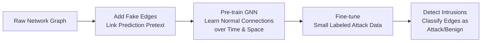
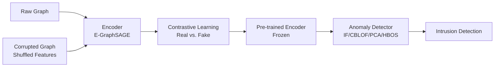
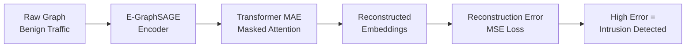
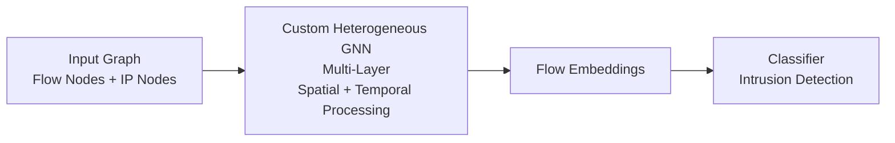
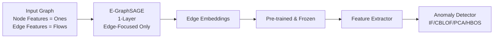
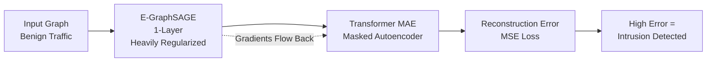

# Benchmarking Encoders and Pretext Tasks for GNN-NIDS

## Introduction

Graph neural networks (GNN) have become really useful for detecting network intrusions nowadays. This makes sense because network traffic is like a graph with hosts as nodes and flows as edges. Three recent papers: PPT-GNN, Anomal-E, and GraphIDS, have taken this idea. Each paper tries to figure out how to learn from network traffic with a small amount of labeled data or without needing any labeled data. Here are the comparisons of two parts of these papers: the pretext tasks they use to teach themselves and the encoder architectures they use to understand the data.

## Pretext Tasks: Three Different Games

### 1. PPT-GNN: Link Prediction
PPT-GNN uses link prediction. The model looks at a graph. It tries to decide if each edge is real or fake. The fake edges are added in a way that makes the model learn about the relationships between nodes over time and space. Once the model is trained, it's fine-tuned on the task of detecting intrusions with a little bit of labeled data. This approach is very straightforward: teach the model what normal connections look like, and use it to spot attacks.

### 2. Anomal-E: Contrastive Learning
Anomal-E does things differently. Its pretext task is contrastive learning, which is a way of teaching the model to distinguish between real and fake data using Deep Graph Infomax (DGI). The model looks at the graph. It tries to figure out if the edges are real or not by comparing them to a summary of the whole graph. This approach requires negative examples, which are created by shuffling the edge features.

### 3. GraphIDS: Masked Reconstruction
GraphIDS takes a different approach. Its pretext task is masked reconstruction. Instead of trying to predict if an edge is real or fake, the model tries to rebuild the graph from a partial view using a Transformer-based Masked Autoencoder (MAE). Some of the connections between nodes are hidden. The model can still see all the node features. The model has to figure out what the original graph looked like. This is similar to how some language models work, but applied to graphs instead of text. One key difference between GraphIDS and the other two papers is that it needs zero labeled data.

## Encoder Architectures

### 1. PPT-GNN: Custom Heterogeneous GNN
The PPT-GNN model employs a specialized graph network, which is structured in such a way as to be able to deal with two classes of nodes: flow nodes and IP nodes. While flow nodes carry properties describing the traffic, the IP nodes carry properties describing timing information, among others. All layers of the model analyze the graph in both spatial and temporal aspects.

### 2. Anomal-E: Edge-Focused E-GraphSAGE
Anomal-E uses a modified version of GraphSAGE that can handle edge features. The node features are all set to the value one, so the model only learns from the edges. This approach is simpler than PPT-GNN. It only uses one layer. The authors chose this approach because it works better with contrastive learning. The model is trained, then frozen and used as a feature extractor for anomaly detection algorithms.

### 3. GraphIDS: Regularized GNN with Transformer
GraphIDS also uses a modified version of GraphSAGE with some key differences. The model is trained with a Transformer in a single step. The gradient flows through both components, which makes the model really good at understanding the relationships between nodes. The graph neural network is also heavily regularized to prevent overfitting. This approach is different from the two papers because the graph neural network is used as a preprocessor for the Transformer rather than the main model.

## Observations and Reflections

What's really interesting about these three papers is how they represent different approaches to the same problem. PPT-GNN tries to build a graph network that can handle time and space natively. Anomal-E takes a simplified approach and uses contrastive learning to get good results. GraphIDS goes further and uses a Transformer to handle the complex patterns in the data.

Each approach has its trade-offs. It's not clear that any one of them is universally better. We can see the field moving towards more integrated, less label-dependent approaches, which is probably a good direction for practical intrusion detection.
